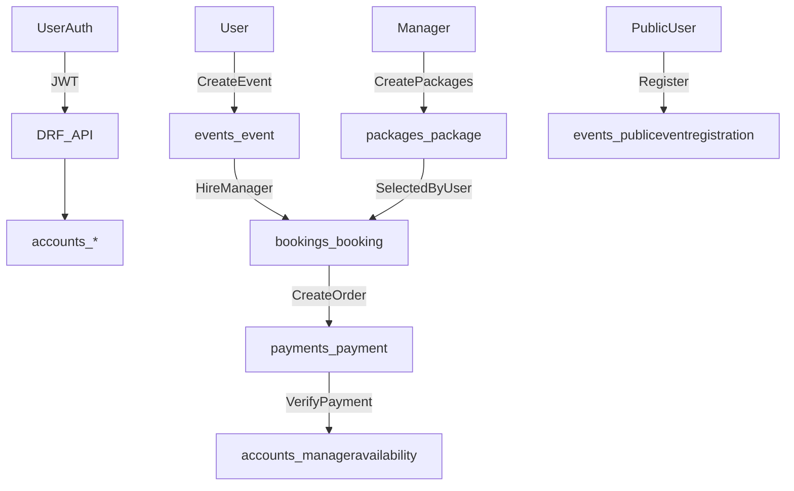

## Goal

Create a **fresh, empty, fully functional** PostgreSQL database for this project where **nothing from the old schema/data remains**, while keeping the **same application workflow and dataflow** (because the schema will be recreated strictly from the current Django models+migrations).

## What I will analyze (dataflow → schema requirements)

- **Backend schema sources** (authoritative):
  - Django models in `utsavora/backend/*/models.py` (accounts, events, bookings, payments, packages, reviews).
  - Migrations in `utsavora/backend/*/migrations/*.py` (the exact schema that will be created).
- **Backend dataflow sources** (what reads/writes which fields):
  - DRF serializers/views/urls:
    - `utsavora/backend/accounts/{views.py,serializers.py,urls.py}`
    - `utsavora/backend/events/{views.py,serializers.py,urls.py}`
    - `utsavora/backend/bookings/{views.py,serializers.py,urls.py}`
    - `utsavora/backend/payments/views.py`
    - `utsavora/backend/packages/{views.py,serializers.py,urls.py}`
    - `utsavora/backend/reviews/{views.py,serializers.py,urls.py}`
- **Frontend integration** (ensures schema supports existing workflow):
  - API callers in `utsavora/frontend/src/services/*.js` and key pages under `utsavora/frontend/src/app/`**.

## Current end-to-end dataflow (what the schema must support)

## Destructive reset strategy (chosen approach: recreate from current models/migrations)

Because you selected **“Drop everything and recreate ONLY by running Django migrations from the CURRENT models”**, the safest way to guarantee:

- **no old schema remains**, and
- **no workflow changes**
…is to:

1. delete the entire `utsavora_db` database, 2) create a brand-new empty `utsavora_db`, 3) run `python manage.py migrate`.

## Execution steps (precise)

### 1) Preconditions & safety

- Confirm backend points to the right DB in `utsavora/backend/config/settings.py` (uses `DB_NAME` default `utsavora_db`).
- Stop backend/frontend servers to prevent active connections.
- Ensure you can authenticate to Postgres as a role with permission to drop/create databases (`postgres` is configured by default).

### 2) Hard delete the old database

- Use one of these (depending on your setup):
  - **Option A (recommended):** `dropdb` / `createdb` utilities.
  - **Option B:** `psql` commands to terminate sessions and `DROP DATABASE`.
- Important considerations:
  - Terminate active connections first (Postgres blocks dropping a DB with active sessions).
  - This guarantees **nothing remains** (schema, tables, indexes, sequences, extensions inside that DB).

### 3) Recreate schema from migrations

- From `utsavora/backend/` run:
  - `python manage.py migrate`
  - (Optional) `python manage.py createsuperuser` (if you need admin access immediately).

### 4) Post-reset verification (no workflow changes)

- Run backend sanity checks:
  - `python manage.py check`
  - Start server and smoke-test key flows:
    - Auth login/register
    - Create event
    - Create package (manager)
    - Booking request + manager accept
    - Payment order + verify (test/fake if used)
    - Manager calendar availability endpoints
    - Public event registration (free/paid)
- Confirm the DB contains only the expected tables:
  - Django core: `auth_`*, `django_`*, `sessions`, etc.
  - App tables: `accounts_*`, `events_*`, `bookings_*`, `payments_*`, `packages_*`, `reviews_*`.

## Performance & scalability considerations (without changing workflow)

- **Indexes/constraints already provided by Django**: FK indexes, uniqueness (`unique_together`) where defined.
- **Targeted checks (read-only review before any future optimization changes):**
  - Query hotspots: manager availability range checks, bookings lists, admin escrow lists.
  - Ensure composite indexes exist where needed (e.g., `(manager_id, date)` already enforced via `unique_together` on `ManagerAvailability`).
  - Avoid N+1: keep `select_related/prefetch_related` in list endpoints (admin escrow uses `select_related`).
- If you later want further optimization, we can add safe indexes via migrations (no API changes), but that’s **not required** for a clean reset.

## Deliverables

- A brand-new empty `utsavora_db` with schema recreated from migrations.
- Confirmation that `/api/...` endpoints still work the same because the code/dataflow did not change.

